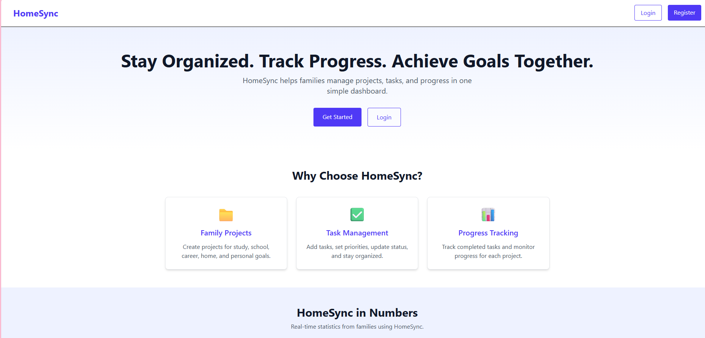
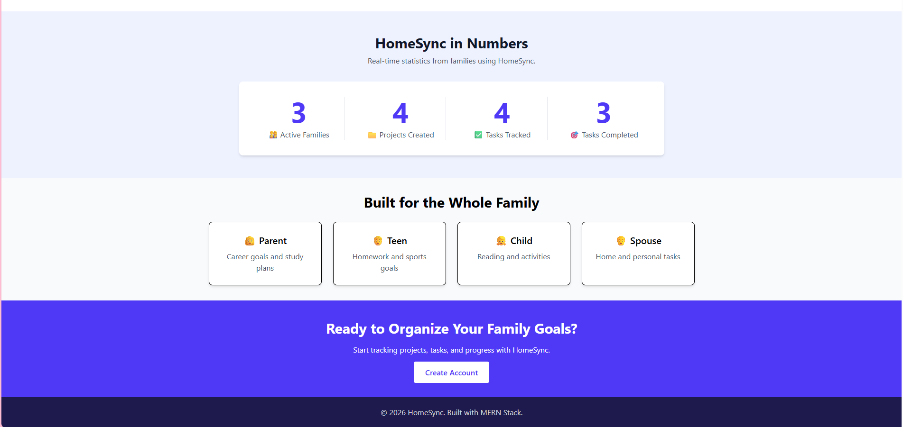
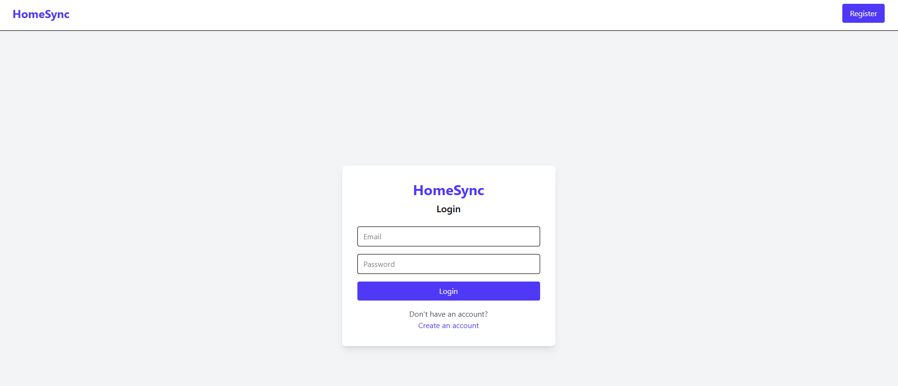
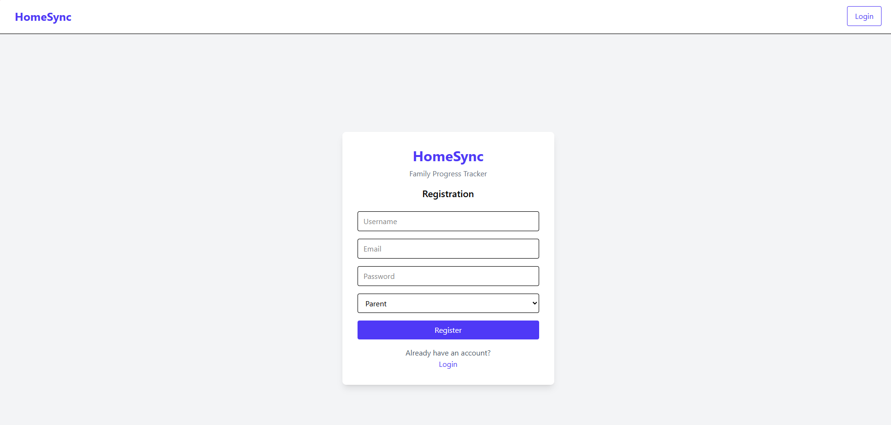
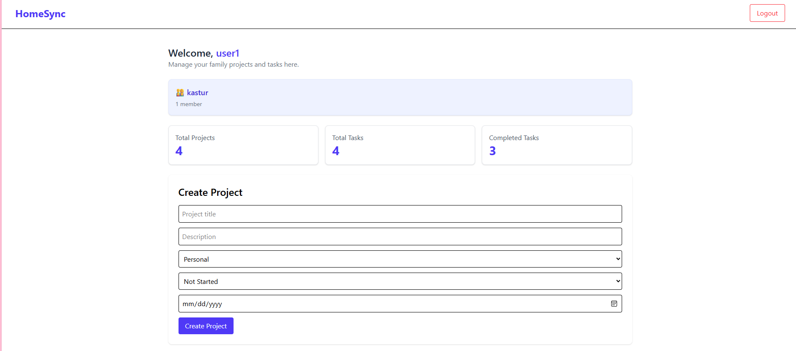
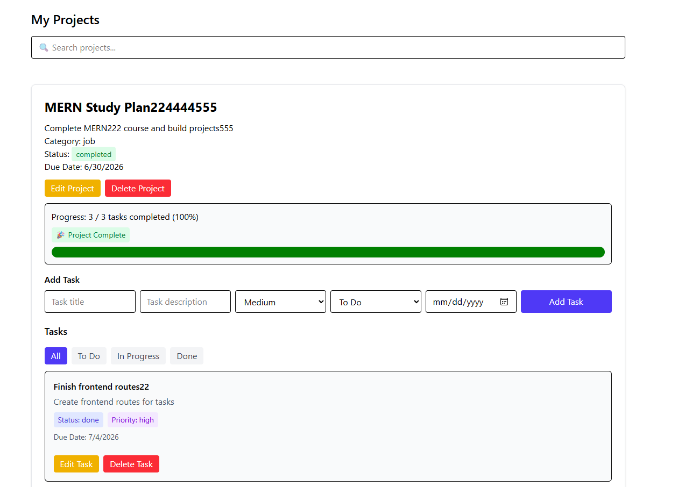
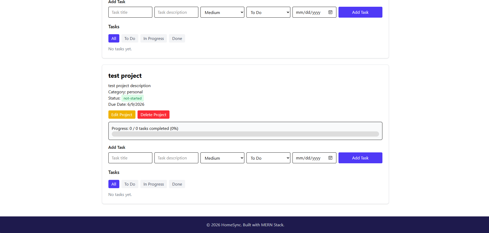

# HomeSync Full-Stack Project

## Overview
HomeSync is a full-stack MERN application that helps families organize projects, manage tasks, and track progress in one place.

Users can:
- Create a family
- Create projects
- Add tasks
- Track progress
- Monitor project completion through a dashboard

## Features

### Authentication
- Register
- Login
- Logout
- JWT Authentication
- Protected Routes

### Family Management
- Create Family
- View Family Details

### Project Management
- Create Project
- View Projects
- Update Project
- Delete Project

### Task Management
- Create Task
- View Tasks
- Update Task Status
- Delete Task

### Dashboard
- Family Overview
- Total Projects
- Total Tasks
- Completed Tasks

### Landing Page
- Features Section
- Statistics Section
- Family Roles Section

## Tech Stack

### Frontend
- React
- TypeScript
- React Router
- Tailwind CSS
- Axios

### Backend
- Node.js
- Express.js
- MongoDB
- Mongoose
- Dotenv

### Authentication
- JWT
- bcrypt

### Deployment
- Render

## Database Models

### User
- username
- email
- password
- role
- family

### Family
- name
- owner
- members

### Project
- title
- description
- category
- status
- dueDate
- user
- family

### Task
- title
- description
- priority
- status
- dueDate
- project

## Screenshots

### Landing Page

![Landing Page]

### Login Page

![Login]

![Register]

### Dashboard

![Dashboard]

## Installation

### Clone Repository

git clone <repo-url>

### Backend

cd backend

npm install

npm run dev

### Frontend

cd frontend

npm install

npm run dev

## Environment Variables

Create a .env file in the backend folder.

PORT=3000
MONGODB_URI=your_mongodb_connection_string
JWT_SECRET=your_secret_key

## API Endpoints

POST /api/users/register
POST /api/users/login

GET /api/families/my-family
POST /api/families

GET /api/projects
POST /api/projects
PUT /api/projects/:id
DELETE /api/projects/:id

GET /api/tasks
POST /api/tasks
PUT /api/tasks/:id
DELETE /api/tasks/:id

GET /api/public/stats

## Future Enhancements

- Family Invitations
- OAuth Authentication
- Charts and Analytics
- Notifications
- File Uploads
- Mobile Responsive Improvements

## Author
Srilatha Puppala

Per Scholas AI-Native Software Development Program

